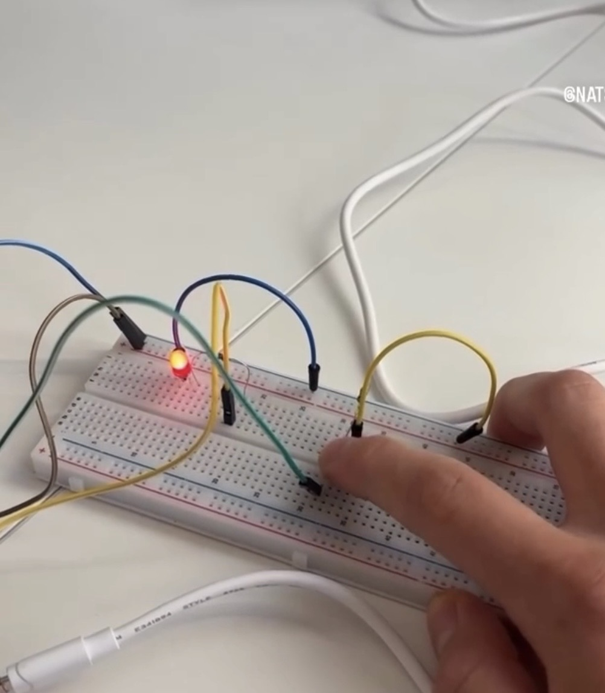

# esp32-midi-pentatonic-instrument

A real-time tap-to-MIDI system built with an ESP32 and Python.

The project maps human timing input into constrained melodic motion. It was designed both as interactive music system and as a small study of how noisy timing affects discrete decision-making.

## Demo

[](media/demo.MP4)

## Overview

The system consists of two parts:

- **ESP32 firmware** that reads a button, debounces it, and emits timestamped press/release events over serial
- **Python runtime** that converts tap timing into monophonic MIDI note playback inside a bounded musical scale

Signal flow:
```text
Button press
    -> serial event
    -> event parser
    -> tap timing analysis
    -> next-note selection
    -> MIDI output
```

## Why this project exists

This project started as the simple "light an LED" electronics project. In order to make it my own I decided to make something interactive and since I've been learning guitar recently I thought making a simple musical interface would be fun! After building it for the first time I did not constrain transitions which led to wild behavior and so I enforced discrete note transitions rather than allowing direct continuous-to-discrete mapping of the time between presses to a note.

That led me to starting a small study of noisy timing input. Human tap timing is variable, but the system must still make a discrete note transition at every step. That means smal timing differences can matter a lot when the input is close to a decision boundary.

## Key result

Using 120 inter-onset interval (IOI) samples collected from repeated tapping at approximately 120 BPM, I measured:

- mean IOI: **499.71 ms**
- standard deviation: **29.49 ms**
- coefficient of variation: **5.90%**
- empirical jitter residual standard deviation: **29.53 ms**

Using those samples as an empirical jitter model, I stress-tested the note-selection logic computationally and found:

- mean flip rate near decision boundaries: **0.253**
- mean flip rate in interior regions: **0.0618**
- boundary instability ratio: **4.09x**
- mean note-sequence divergence under Monte Carlo perturbation: **0.604**

My interpretation of this is that the system is much more sensitive to timing noise near threshold boundaries than away from them.

## Repository structure
```text
tap_mapper/
    domain/    # pure musical logic
    adapters/  # serial and MIDI I/O
    runtime.py # orchestration
tools/         # data collection and analysis scripts
data/          # collected IOI samples
analysis/      # generated reports
```

## Installation

### Python
Create and activate a virtual environment, then install dependencies:
```bash
python -m venv .venv
source .venv/bin/activate
pip install -r requirements.txt
```

### Python dependencies
- pygame
- pyserial

### MIDI setup
On macOS, enable the IAC Driver in Audio MIDI Setup if you want to route MIDI into a DAW or synth

## Running the project

### 1. Flash the ESP32 firmware
Upload `ButtonSerialBridge.ino` to the ESP32

### 2. Update the serial port
Edit `tap_mapper/config.py` and set the serial port to your device

### 3. Run the Python runtime
```bash
python -m tap_mapper
```

## Collecting IOI data
You can collect tap timing data without the microcontroller by using the keyboard-based collector:
```bash
python -m tools.collect_ioi_samples --out path/to/samples.csv --target-taps 121
```

This records tap timestamps and IOIs to CSV.

## Running the analysis
```bash
python -m tools.analyze_ioi_samples path/to/samples.csv --out path/to/report.json --runs 500
```

This computes input noise metrics, empirical jitter residuals, boundary sensitivity, and note-sequence instability under Monte Carlo perturbation

## Limitations
This project does not eliminate timing noise. Instead it measures the variability via analysis tools, constrains the output space via discrete transitions, and makes threshold-sensitive behavior explicit and testable via modularity.

The system is intentionally simple and monophonic. The goal is clarity and analyzability rather than musical complexity.

